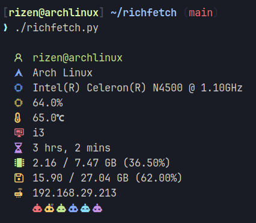

<div align="center">
# richfetch

> A richly customisable fetch utility which provides a ton lot of information. Written in Python.

## Sample:

</div>

## Capabilities:
`richfetch` displays the following info (in order):

- user@hostname
- os name
- cpu usage %age
- cpu temp
- WM name
- uptime
- ram used/total ram (ram usage %age)
- disk used/total disk (disk usage %age)
- local ip
- public ip (*do not forget to hide this when posting screenshots etc*)

`richfetch` uses [**nerdfonts**](https://www.nerdfonts.com/) to display the symbols. What I use is JetBrains Mono Nerd Font so I know it works. You can try different nerd fonts to see if your works.

## Installation
```bash
git clone https://github.com/Rizen54/richfetch
cd richfetch/
python3 -m pip install -r requirements.txt
chmod +x richfetch.py
sudo cp richfetch.py /usr/local/bin/richfetch
alias richfetch='python3 /usr/local/bin/richfetch'
```

Lastly, add this line to the end of your `.bashrc` or `.zshrc`:

```bash
alias richfetch='python3 /usr/local/bin/richfetch'
```

If you're like me and you use arch linux and install python modules from arch repo. You can do this:
`sudo pacman -Sy python-cpuinfo python-psutil python-requests python-termcolor`

## Special Features:
Short note: I'm very happy and proud of these.

- Dynamic colors for OS Symbol, RAM/DISK/CPU Usage and CPU Temp
- Local and public IPs (Public IP is disabled by default, you can enable it by simply un-commenting a line)
- Nerd Fonts for logos instead of ASCII art (minimalism is they key.)
- The ease of customizing it.
